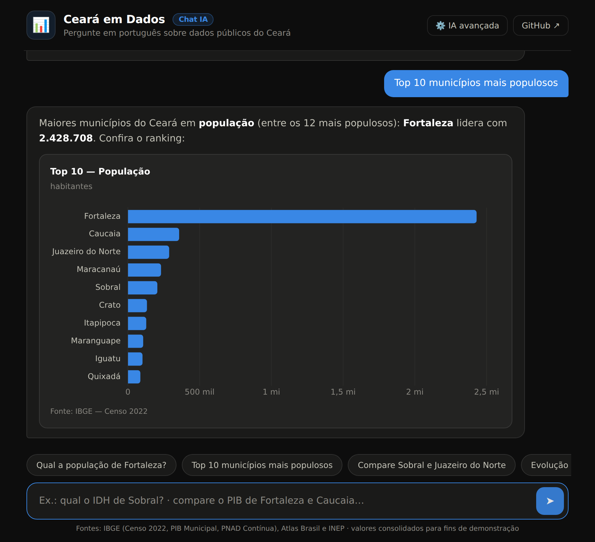
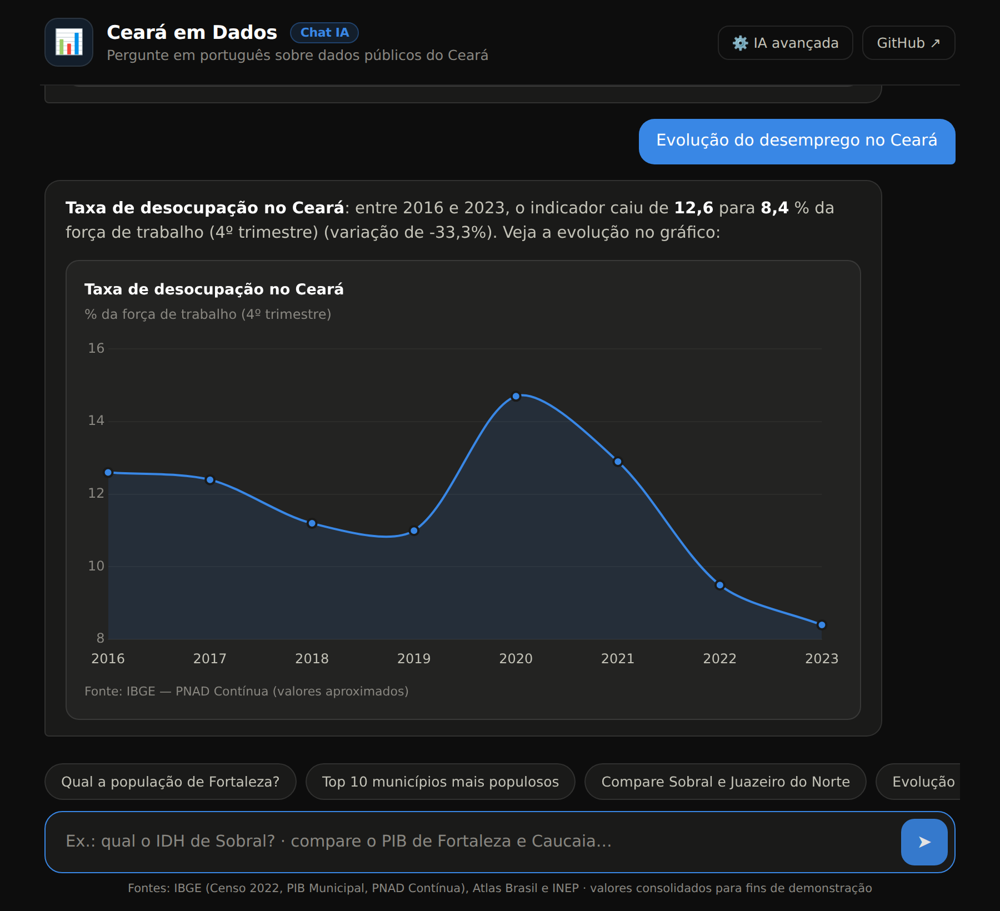

# 📊 Ceará em Dados — Chat IA

> Pergunte em **português** sobre dados públicos do Ceará e receba a resposta com **texto + gráfico interativo**, gerados na hora por um motor de linguagem natural que roda 100% no navegador.


<p align="center">
  
</p>

## 💡 O que é

Evolução do projeto **Ceará em Dados**: em vez de dashboards fixos, agora é um **chatbot**. Você digita uma pergunta em linguagem natural — como faria com uma pessoa — e o sistema:

1. **Entende** a pergunta (intenção + entidades + indicador)
2. **Consulta** a base de dados públicos embutida
3. **Responde** com texto explicativo e o **gráfico mais adequado** (barras para rankings e comparações, linha para séries temporais, cartão de destaque para valores pontuais)

### Exemplos de perguntas

| Pergunta | O que acontece |
|---|---|
| *"Qual a população de Fortaleza?"* | Cartão com o número + posição no ranking |
| *"Top 10 municípios mais populosos"* | Gráfico de barras com o ranking |
| *"Compare Sobral e Juazeiro do Norte"* | Barras lado a lado |
| *"Evolução do PIB do Ceará"* | Gráfico de linha 2010–2021 |
| *"Como está o desemprego no Ceará?"* | Série da PNAD Contínua 2016–2023 |
| *"Top 5 em densidade"* | Ranking de densidade demográfica |

<p align="center">
  
</p>

## 🧠 Como a "IA" funciona

O coração do projeto é um **pipeline de NLU (Natural Language Understanding) escrito do zero em JavaScript puro**, sem nenhuma dependência — roda inteiro no navegador:

```
pergunta → normalização → extração de entidades → detecção de indicador → classificação de intenção → resposta estruturada → gráfico
```

- **Normalização** — minúsculas, remoção de acentos e pontuação
- **Extração de entidades** — casamento por dicionário dos municípios cearenses
- **Detecção de indicador** — população, PIB, PIB per capita, IDHM, IDEB, desemprego, área, densidade
- **Classificação de intenção** — valor pontual · ranking (com top N dinâmico) · comparação · evolução temporal · ajuda/saudação
- **Resposta estruturada** — um objeto `{ texto, grafico | stat }` que a interface transforma em balão de chat + visualização

### ✨ Modo IA avançada (opcional)

No botão **⚙️ IA avançada**, dá para colar uma chave gratuita da [API do Google Gemini](https://aistudio.google.com/apikey). Aí a resposta local vira **contexto** para o LLM reescrever o texto de forma mais natural — os números continuam vindo da base local (nada de alucinação de dados), e a chave fica só no `localStorage` do navegador. Sem chave, tudo funciona igual: o app **não depende de nenhum serviço externo**.

## 🗂️ Estrutura

```
├── index.html          # estrutura da página (chat, sugestões, modal)
├── css/style.css       # tema escuro, paleta acessível validada p/ daltonismo
├── js/
│   ├── data.js         # base de dados embutida (municípios + séries do estado)
│   ├── nlu.js          # motor de linguagem natural (o cérebro)
│   ├── charts.js       # renderização dos gráficos (Chart.js)
│   └── app.js          # controle do chat + integração opcional c/ Gemini
├── vendor/chart.umd.min.js  # Chart.js embutido (funciona offline)
└── docs/               # screenshots
```

## 📚 Fontes dos dados

| Indicador | Fonte |
|---|---|
| População (12 maiores municípios) | IBGE — Censo Demográfico 2022 |
| PIB do estado e PIB per capita | IBGE — Contas Regionais / PIB dos Municípios (valores aproximados) |
| IDHM | Atlas Brasil / PNUD — IDHM 2010 |
| IDEB (anos iniciais, rede pública) | INEP (valores aproximados) |
| Taxa de desocupação | IBGE — PNAD Contínua (valores aproximados) |

> ⚠️ Valores consolidados manualmente para fins de demonstração e portfólio — para uso oficial, consulte sempre as fontes originais.

## 🚀 Como rodar

🔗 **App no ar:** https://paulomatiasxvs.github.io/PROJETO-CEAR-EM-DADOS/

Para rodar localmente, não precisa instalar nada:

```bash
git clone https://github.com/PauloMatiasxvs/PROJETO-CEAR-EM-DADOS.git
cd PROJETO-CEAR-EM-DADOS
# abra o index.html no navegador, ou:
python3 -m http.server 8000   # → http://localhost:8000
```

O deploy no GitHub Pages é automático a cada push na `main` (workflow em `.github/workflows/deploy.yml`).

## 🗺️ Próximos passos

- [ ] Todos os 184 municípios do Ceará via API do IBGE
- [ ] Mais séries históricas (saúde, segurança, chuvas/FUNCEME)
- [ ] Modo de voz (Web Speech API)
- [ ] Exportar o gráfico como imagem direto do chat

## 📄 Licença

[MIT](LICENSE) — use, estude e adapte à vontade.

---

Feito com 💙 por [Paulo Matias](https://github.com/PauloMatiasxvs) · dados públicos + IA + Ceará 🌵
